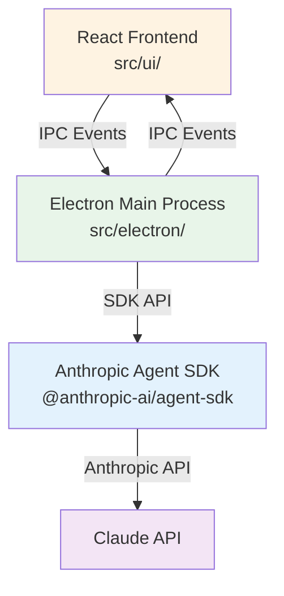
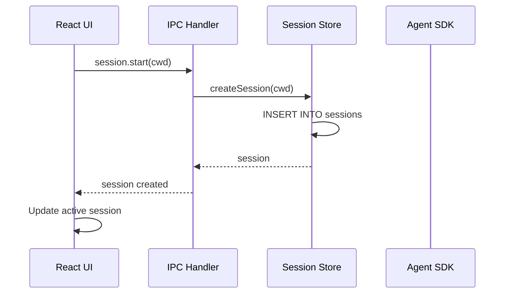
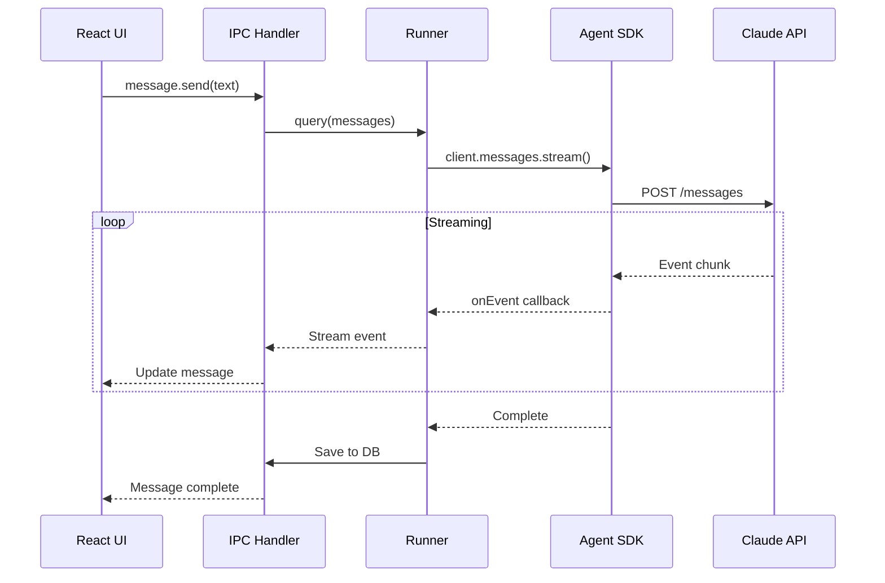

# Architecture

A deep dive into Agent Cowork's system design, data flow, and key components.

## High-Level Overview

Agent Cowork is built on a three-layer architecture:



## Component Layers

### 1. React Frontend (`src/ui/`)

**Purpose**: User interface and client-side state management

**Key Technologies:**
- React 19 (with TypeScript)
- Zustand (state management)
- Tailwind CSS 4 (styling)
- Vite (bundler)

**Main Components:**

```
src/ui/
├── App.tsx                    # Root component
├── components/
│   ├── Sidebar.tsx           # Session list, navigation
│   ├── EventCard.tsx         # Message/event display
│   ├── PromptInput.tsx       # User input field
│   ├── StartSessionModal.tsx # Session creation dialog
│   └── Settings.tsx          # Settings panel
├── store/
│   └── useAppStore.ts        # Zustand store
├── index.css                 # Tailwind config
└── main.tsx                  # Entry point
```

**Responsibilities:**
- Render UI components
- Handle user interactions
- Manage client-side state (current session, UI state)
- Send IPC events to main process
- Display messages and events

### 2. Electron Main Process (`src/electron/`)

**Purpose**: Backend logic, IPC routing, and SDK integration

**Key Technologies:**
- Electron (desktop framework)
- Node.js
- Better-SQLite3 (database)
- Anthropic Agent SDK

**Main Modules:**

```
src/electron/
├── main.ts                   # Electron entry point
├── ipc-handlers.ts           # IPC event routing
├── libs/
│   ├── runner.ts            # SDK query() wrapper (CORE)
│   ├── session-store.ts     # Session persistence
│   ├── claude-settings.ts   # API configuration
│   ├── config-store.ts      # App configuration
│   └── state-sync.ts        # Session state management
└── types.ts                 # Type definitions
```

**Responsibilities:**
- Handle IPC events from renderer
- Manage session lifecycle
- Persist data to SQLite
- Integrate with Anthropic SDK
- Stream responses back to UI
- Manage file system access

### 3. Anthropic Agent SDK

**Purpose**: AI agent orchestration and tool execution

**Features Used:**
- Streaming API calls
- Tool execution (Read, Edit, Bash, Grep, Glob)
- Agent coordination
- MCP server integration
- Hook system

**Integration Point**: `src/electron/libs/runner.ts`

## Data Flow

### Session Creation Flow



### Message Send Flow



## Key Design Patterns

### 1. IPC Communication

**Pattern**: Event-based RPC between renderer and main process

**Implementation**: `src/electron/ipc-handlers.ts`

```typescript
// Renderer → Main
ipcRenderer.send('session.start', { cwd: '/path/to/project' })

// Main → Renderer (response)
ipcMain.on('session.start', async (event, payload) => {
  const session = await sessionStore.createSession(payload.cwd)
  event.sender.send('session.created', session)
})
```

**Events:**
- `session.start`: Create new session
- `session.list`: Get all sessions
- `session.delete`: Delete session
- `message.send`: Send user message
- `message.stream`: Stream SDK response
- `settings.get/set`: Manage configuration

### 2. State Management (Zustand)

**Pattern**: Centralized client-side state with minimal boilerplate

**Implementation**: `src/ui/store/useAppStore.ts`

```typescript
interface AppState {
  // Session state
  sessions: Session[]
  activeSessionId: string | null

  // UI state
  settingsOpen: boolean

  // Actions
  setActiveSession: (id: string) => void
  addMessage: (sessionId: string, message: Message) => void
  // ...
}

export const useAppStore = create<AppState>((set) => ({
  sessions: [],
  activeSessionId: null,
  settingsOpen: false,

  setActiveSession: (id) => set({ activeSessionId: id }),
  // ...
}))
```

**Usage in Components:**
```typescript
const { sessions, activeSessionId } = useAppStore()
```

### 3. Session Persistence

**Pattern**: SQLite for local data storage

**Schema**: `src/electron/libs/session-store.ts`

```sql
CREATE TABLE sessions (
  id TEXT PRIMARY KEY,
  cwd TEXT NOT NULL,
  createdAt INTEGER NOT NULL,
  lastAccessedAt INTEGER NOT NULL,
  metadata TEXT
);

CREATE TABLE messages (
  id TEXT PRIMARY KEY,
  sessionId TEXT NOT NULL,
  role TEXT NOT NULL,  -- 'user' | 'assistant'
  content TEXT NOT NULL,
  createdAt INTEGER NOT NULL,
  FOREIGN KEY (sessionId) REFERENCES sessions(id) ON DELETE CASCADE
);

CREATE TABLE events (
  id TEXT PRIMARY KEY,
  sessionId TEXT NOT NULL,
  messageId TEXT NOT NULL,
  type TEXT NOT NULL,  -- 'tool_use' | 'text' | 'thinking'
  data TEXT NOT NULL,   -- JSON
  createdAt INTEGER NOT NULL,
  FOREIGN KEY (messageId) REFERENCES messages(id) ON DELETE CASCADE
);
```

### 4. SDK Integration

**Pattern**: Wrapper around SDK with custom configuration

**Implementation**: `src/electron/libs/runner.ts:63`

```typescript
export async function query(
  messages: Message[],
  options: QueryOptions
): Promise<void> {
  const config = await getEnhancedEnv()
  const client = createClient({ apiKey: config.apiKey })

  const stream = client.messages.stream({
    model: config.model || 'claude-sonnet-4-5-20250929',
    max_tokens: 8192,
    messages,
    tools: options.allowedTools || DEFAULT_TOOLS,
    // Future: Add MCP servers, hooks, agents here
  })

  for await (const event of stream) {
    options.onEvent(event)
  }
}
```

**Extension Points:**
- `allowedTools`: Control which tools are available
- `mcpServers`: Add external tool servers
- `hooks`: Pre/post tool execution callbacks
- `agents`: Multi-agent coordination
- `systemPrompt`: Custom system instructions

## File System Organization

### Frontend Structure

```
src/ui/
├── components/           # React components
│   ├── Sidebar.tsx
│   ├── EventCard.tsx
│   ├── PromptInput.tsx
│   └── ...
├── store/               # Zustand stores
│   └── useAppStore.ts
├── hooks/               # Custom React hooks
├── utils/               # Utility functions
├── index.css            # Tailwind CSS
└── main.tsx             # Entry point
```

### Backend Structure

```
src/electron/
├── main.ts              # Electron app initialization
├── ipc-handlers.ts      # IPC event routing
├── libs/                # Core libraries
│   ├── runner.ts       # SDK wrapper (PRIMARY)
│   ├── session-store.ts # SQLite persistence
│   ├── claude-settings.ts # API config
│   ├── config-store.ts  # App config
│   └── state-sync.ts   # State management
└── types.ts            # Shared types
```

## Security Considerations

### 1. File System Access

**Risk**: AI assistant has read/write access to CWD

**Mitigation:**
- User explicitly selects working directory
- No access outside CWD (enforced by tool implementations)
- File operations logged in UI

### 2. Bash Command Execution

**Risk**: AI can execute arbitrary shell commands

**Mitigation:**
- User sees all commands before execution (via EventCard)
- Commands run in selected CWD only
- Can be disabled via tool restrictions

### 3. API Key Storage

**Risk**: API key stored in plaintext

**Current State**: Stored in config.json (plaintext)

**Future Enhancement**: Use system keychain (Keytar/Electron-store encryption)

### 4. IPC Security

**Protection**: Context isolation enabled in Electron

```typescript
// main.ts
const mainWindow = new BrowserWindow({
  webPreferences: {
    contextIsolation: true,
    nodeIntegration: false,
    preload: path.join(__dirname, 'preload.js')
  }
})
```

## Performance Characteristics

### Streaming

**Benefit**: UI updates in real-time as SDK generates responses

**Implementation**: Server-Sent Events (SSE) from SDK → IPC events → React state updates

### Database

**Better-SQLite3**: Synchronous API, faster than async alternatives for Electron

**Indexing**: Sessions indexed by `id`, messages by `sessionId`

### Build Size

**Approximate sizes:**
- macOS ARM64: ~150 MB (DMG)
- Windows x64: ~180 MB (NSIS installer)
- Linux x64: ~200 MB (AppImage)

## Extension Points

Agent Cowork is designed for customization:

1. **UI Components**: Add new React components in `src/ui/components/`
2. **State Management**: Extend Zustand store in `src/ui/store/useAppStore.ts`
3. **IPC Events**: Add handlers in `src/electron/ipc-handlers.ts`
4. **SDK Configuration**: Modify `src/electron/libs/runner.ts:63`
5. **Personality System**: Config-based AI specialization (coming soon)
6. **Build Variants**: Create domain-specific binaries

## Next Steps

- **[Frontend Guide](/guides/frontend/overview)** - Learn React patterns
- **[Backend Guide](/guides/backend/overview)** - Understand Electron integration
- **[Personality System](/personality-system/overview)** - Create specialized variants
- **[Cookbook](/cookbook/add-ui-component)** - Try practical examples
