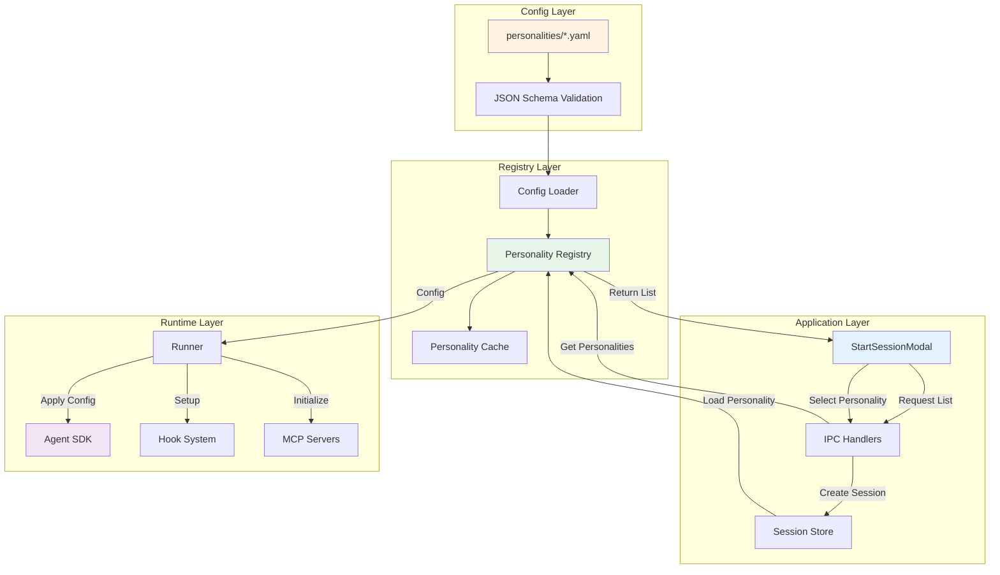
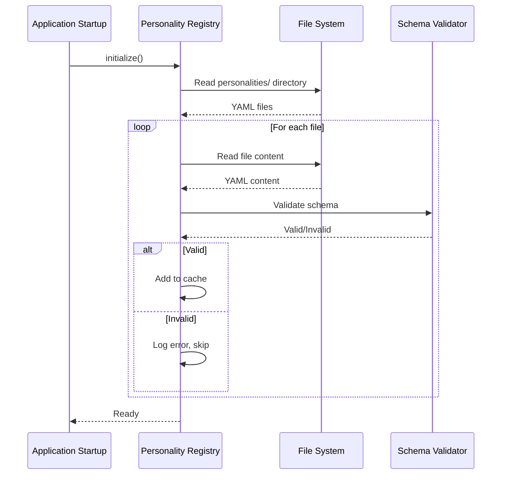
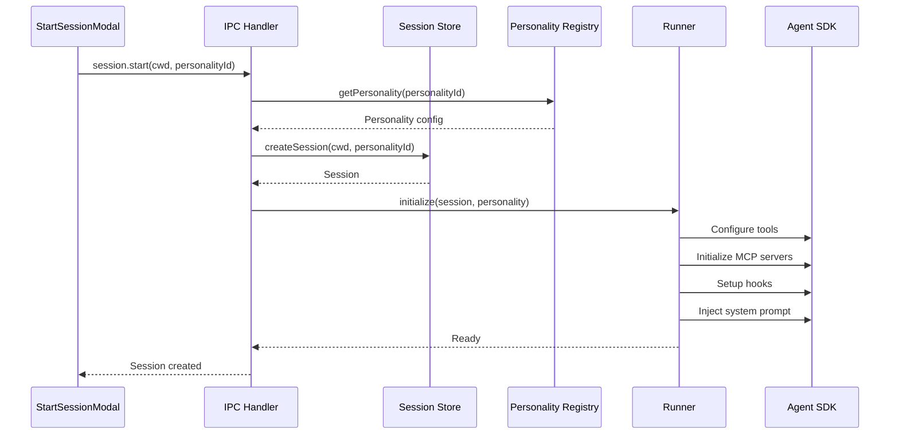

# Personality System Architecture

Technical design and implementation details for the Personality System.

## Design Principles

1. **Config-Driven**: Personalities defined in YAML/JSON files
2. **Modular**: Reusable components (tools, MCP servers, hooks)
3. **Extensible**: Easy to add new personalities
4. **Type-Safe**: Full TypeScript support
5. **Secure**: Validation and sandboxing

## System Architecture



## Data Flow

### Personality Loading Flow



### Session Creation Flow with Personality



## Extension Points

### 1. Personality Registry Module

**Path**: `src/electron/libs/personality-registry.ts` (NEW FILE)

**Purpose**: Load, validate, and manage personality configurations

**Interface:**
```typescript
export interface PersonalityConfig {
  // Metadata
  name: string
  description: string
  version: string
  author?: string

  // Tool configuration
  tools?: {
    allowed?: string[]
    denied?: string[]
  }

  // MCP server configuration
  mcpServers?: MCPServerConfig[]

  // System prompt
  systemPrompt?: string

  // Model selection
  model?: string

  // Hook configuration
  hooks?: {
    preToolUse?: string
    postToolUse?: string
    sessionStart?: string
    sessionEnd?: string
  }

  // Default settings
  defaults?: {
    cwd?: string
    autoSave?: boolean
  }
}

export interface MCPServerConfig {
  name: string
  type: 'stdio' | 'http' | 'sse' | 'sdk'

  // For stdio servers
  command?: string
  args?: string[]
  env?: Record<string, string>

  // For HTTP servers
  url?: string
  apiKey?: string
  headers?: Record<string, string>
}

export class PersonalityRegistry {
  private personalities: Map<string, PersonalityConfig> = new Map()

  /**
   * Initialize registry by loading all personality configs
   */
  async initialize(personalitiesDir: string): Promise<void>

  /**
   * Get all available personalities
   */
  listPersonalities(): PersonalityConfig[]

  /**
   * Get personality by ID
   */
  getPersonality(id: string): PersonalityConfig | null

  /**
   * Validate personality config against schema
   */
  validateConfig(config: unknown): PersonalityConfig

  /**
   * Reload personalities from disk
   */
  async reload(): Promise<void>
}
```

**Implementation:**
```typescript
import * as fs from 'fs/promises'
import * as path from 'path'
import * as yaml from 'yaml'
import Ajv from 'ajv'

const ajv = new Ajv()

// JSON Schema for validation
const personalitySchema = {
  type: 'object',
  required: ['name', 'description', 'version'],
  properties: {
    name: { type: 'string', minLength: 1 },
    description: { type: 'string' },
    version: { type: 'string', pattern: '^\\d+\\.\\d+\\.\\d+$' },
    tools: {
      type: 'object',
      properties: {
        allowed: { type: 'array', items: { type: 'string' } },
        denied: { type: 'array', items: { type: 'string' } }
      }
    },
    mcpServers: {
      type: 'array',
      items: {
        type: 'object',
        required: ['name', 'type'],
        properties: {
          name: { type: 'string' },
          type: { enum: ['stdio', 'http', 'sse', 'sdk'] },
          command: { type: 'string' },
          args: { type: 'array', items: { type: 'string' } },
          url: { type: 'string', format: 'uri' }
        }
      }
    },
    systemPrompt: { type: 'string' },
    model: { type: 'string' },
    hooks: {
      type: 'object',
      properties: {
        preToolUse: { type: 'string' },
        postToolUse: { type: 'string' }
      }
    }
  }
}

const validatePersonality = ajv.compile(personalitySchema)

export class PersonalityRegistry {
  private personalities: Map<string, PersonalityConfig> = new Map()
  private personalitiesDir: string = ''

  async initialize(personalitiesDir: string): Promise<void> {
    this.personalitiesDir = personalitiesDir

    // Ensure directory exists
    await fs.mkdir(personalitiesDir, { recursive: true })

    // Load all YAML files
    const files = await fs.readdir(personalitiesDir)
    const yamlFiles = files.filter((f) => f.endsWith('.yaml') || f.endsWith('.yml'))

    for (const file of yamlFiles) {
      const filePath = path.join(personalitiesDir, file)

      try {
        const content = await fs.readFile(filePath, 'utf-8')
        const config = yaml.parse(content)

        // Validate schema
        const validatedConfig = this.validateConfig(config)

        // Generate ID from filename
        const id = path.basename(file, path.extname(file))

        this.personalities.set(id, validatedConfig)
        console.log(`[PersonalityRegistry] Loaded: ${id}`)
      } catch (error) {
        console.error(`[PersonalityRegistry] Failed to load ${file}:`, error)
      }
    }
  }

  listPersonalities(): PersonalityConfig[] {
    return Array.from(this.personalities.values())
  }

  getPersonality(id: string): PersonalityConfig | null {
    return this.personalities.get(id) || null
  }

  validateConfig(config: unknown): PersonalityConfig {
    if (!validatePersonality(config)) {
      throw new Error(
        `Invalid personality config: ${JSON.stringify(validatePersonality.errors)}`
      )
    }

    return config as PersonalityConfig
  }

  async reload(): Promise<void> {
    this.personalities.clear()
    await this.initialize(this.personalitiesDir)
  }
}

// Singleton instance
export const personalityRegistry = new PersonalityRegistry()
```

### 2. Runner Integration

**Path**: `src/electron/libs/runner.ts`

**Current State** (line 63):
```typescript
export async function query(
  messages: Message[],
  options: QueryOptions
): Promise<void> {
  const config = await getEnhancedEnv()
  const client = createClient({ apiKey: config.apiKey })

  const stream = client.messages.stream({
    model: config.model || 'claude-sonnet-4-5-20250929',
    max_tokens: 8192,
    messages,
    tools: DEFAULT_TOOLS,
    // TODO: Add MCP servers, hooks, agents
  })

  for await (const event of stream) {
    options.onEvent(event)
  }
}
```

**Enhanced with Personality Support**:
```typescript
export interface QueryOptions {
  onEvent: (event: Event) => void
  personality?: PersonalityConfig  // NEW
}

export async function query(
  messages: Message[],
  options: QueryOptions
): Promise<void> {
  const config = await getEnhancedEnv()
  const client = createClient({ apiKey: config.apiKey })

  // Apply personality configuration
  const personality = options.personality

  // Determine tools
  let tools = DEFAULT_TOOLS
  if (personality?.tools) {
    if (personality.tools.allowed) {
      tools = DEFAULT_TOOLS.filter((t) => personality.tools.allowed.includes(t.name))
    }
    if (personality.tools.denied) {
      tools = tools.filter((t) => !personality.tools.denied.includes(t.name))
    }
  }

  // Initialize MCP servers
  let mcpServers: MCPServer[] = []
  if (personality?.mcpServers) {
    mcpServers = await initializeMCPServers(personality.mcpServers)
  }

  // Setup hooks
  let hooks: Hooks | undefined
  if (personality?.hooks) {
    hooks = await loadHooks(personality.hooks)
  }

  // Inject system prompt
  let messagesWithPrompt = messages
  if (personality?.systemPrompt) {
    messagesWithPrompt = [
      { role: 'system', content: personality.systemPrompt },
      ...messages
    ]
  }

  // Select model
  const model = personality?.model || config.model || 'claude-sonnet-4-5-20250929'

  const stream = client.messages.stream({
    model,
    max_tokens: 8192,
    messages: messagesWithPrompt,
    tools,
    mcpServers,
    hooks
  })

  for await (const event of stream) {
    options.onEvent(event)
  }
}
```

### 3. Session Store Integration

**Path**: `src/electron/libs/session-store.ts`

**Schema Update**:
```sql
-- Add personality column to sessions table
ALTER TABLE sessions ADD COLUMN personalityId TEXT;
```

**Type Update**:
```typescript
export interface Session {
  id: string
  cwd: string
  createdAt: number
  lastAccessedAt: number
  metadata?: string
  personalityId?: string  // NEW
}
```

**Store Methods**:
```typescript
export class SessionStore {
  createSession(cwd: string, personalityId?: string): Session {
    const session = {
      id: generateId(),
      cwd,
      createdAt: Date.now(),
      lastAccessedAt: Date.now(),
      personalityId
    }

    this.db.prepare(`
      INSERT INTO sessions (id, cwd, createdAt, lastAccessedAt, personalityId)
      VALUES (?, ?, ?, ?, ?)
    `).run(session.id, session.cwd, session.createdAt, session.lastAccessedAt, session.personalityId)

    return session
  }

  getSession(id: string): Session | null {
    return this.db.prepare(`
      SELECT * FROM sessions WHERE id = ?
    `).get(id) as Session | null
  }
}
```

### 4. UI Integration

**Path**: `src/ui/components/StartSessionModal.tsx`

**Current State** (line 22-26):
```typescript
export const StartSessionModal: FC = () => {
  const [cwd, setCwd] = useState('')

  const handleSubmit = () => {
    window.ipc.send('session.start', { cwd })
  }

  // ...
}
```

**Enhanced with Personality Selector**:
```typescript
export const StartSessionModal: FC = () => {
  const [cwd, setCwd] = useState('')
  const [personalityId, setPersonalityId] = useState('default')
  const [personalities, setPersonalities] = useState<PersonalityConfig[]>([])

  // Load personalities on mount
  useEffect(() => {
    window.ipc.send('personality.list')
    window.ipc.once('personality.list-response', (list) => {
      setPersonalities(list)
    })
  }, [])

  const handleSubmit = () => {
    window.ipc.send('session.start', {
      cwd,
      personalityId: personalityId !== 'default' ? personalityId : undefined
    })
  }

  return (
    <Modal title="New Session">
      {/* Personality Selector */}
      <div className="mb-4">
        <label className="block text-sm font-medium mb-1">Personality</label>
        <select
          value={personalityId}
          onChange={(e) => setPersonalityId(e.target.value)}
          className="w-full border rounded-md px-3 py-2"
        >
          <option value="default">Default (No specialization)</option>
          {personalities.map((p) => (
            <option key={p.name} value={p.name}>
              {p.name} - {p.description}
            </option>
          ))}
        </select>
      </div>

      {/* Working Directory */}
      <div className="mb-4">
        <label className="block text-sm font-medium mb-1">Working Directory</label>
        <input
          type="text"
          value={cwd}
          onChange={(e) => setCwd(e.target.value)}
          className="w-full border rounded-md px-3 py-2"
        />
      </div>

      <button onClick={handleSubmit}>Start Session</button>
    </Modal>
  )
}
```

### 5. IPC Events

**Path**: `src/electron/ipc-handlers.ts`

**New Handlers**:
```typescript
import { personalityRegistry } from './libs/personality-registry'

export function registerIpcHandlers() {
  // List available personalities
  ipcMain.on('personality.list', (event) => {
    const personalities = personalityRegistry.listPersonalities()
    event.sender.send('personality.list-response', personalities)
  })

  // Start session with personality
  ipcMain.on('session.start', async (event, payload) => {
    const { cwd, personalityId } = payload

    // Get personality config if specified
    let personality: PersonalityConfig | undefined
    if (personalityId) {
      personality = personalityRegistry.getPersonality(personalityId) || undefined
    }

    // Create session
    const session = sessionStore.createSession(cwd, personalityId)

    // Store personality for runtime use
    sessions.set(session.id, { session, personality })

    event.sender.send('session.created', session)
  })

  // Reload personalities (for development)
  ipcMain.on('personality.reload', async (event) => {
    await personalityRegistry.reload()
    const personalities = personalityRegistry.listPersonalities()
    event.sender.send('personality.list-response', personalities)
  })
}
```

## File Structure

```
agent-cowork/
├── personalities/                    # Personality configs (NEW)
│   ├── medical-assistant.yaml
│   ├── legal-reviewer.yaml
│   ├── financial-auditor.yaml
│   └── security-focused.yaml
├── src/
│   ├── electron/
│   │   ├── libs/
│   │   │   ├── personality-registry.ts  # NEW
│   │   │   ├── runner.ts               # MODIFIED
│   │   │   └── session-store.ts        # MODIFIED
│   │   ├── ipc-handlers.ts            # MODIFIED
│   │   └── types.ts                   # MODIFIED (add Personality types)
│   └── ui/
│       └── components/
│           └── StartSessionModal.tsx  # MODIFIED
└── hooks/                            # Hook scripts (NEW)
    ├── audit-logger.js
    └── hipaa-checker.js
```

## Security Considerations

### 1. Config Validation

**Risk**: Malicious personality configs could execute arbitrary code

**Mitigation**:
- JSON Schema validation on all configs
- Whitelist allowed tool names
- Validate MCP server URLs
- Sanitize hook script paths

### 2. Hook Sandboxing

**Risk**: Hook scripts could access system resources

**Mitigation**:
- Run hooks in isolated Node.js VM
- Restrict file system access
- Timeout enforcement
- Error handling

### 3. MCP Server Security

**Risk**: MCP servers could expose sensitive APIs

**Mitigation**:
- Require explicit user consent for external servers
- API key encryption
- Network request logging
- Rate limiting

## Next Steps

- **[Creating Personalities](/personality-system/creating-personalities)** - Build your first personality
- **[Examples](/personality-system/examples/medical)** - Real-world examples
- **[SDK Integration](/sdk-integration/mcp-servers/overview)** - Learn about MCP servers
