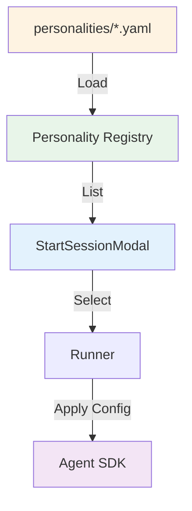

# Personality System Overview

The Personality System enables you to create domain-specialized versions of Agent Cowork tailored to specific industries, use cases, or workflows.

## What is a Personality?

A **personality** is a configuration profile that customizes how the AI assistant behaves, including:

- **Allowed tools**: Which tools the assistant can use (Read, Edit, Bash, etc.)
- **MCP servers**: External tool integrations (APIs, databases, specialized tools)
- **System prompt**: Custom instructions and domain expertise
- **Hooks**: Pre/post tool execution for logging, validation, compliance
- **Model selection**: Which Claude model to use
- **Default settings**: CWD patterns, UI preferences, etc.

## Why Use Personalities?

### Problem: One-Size-Fits-All

**Current State**: Agent Cowork uses the same configuration for all use cases.

**Limitations:**
- Medical users need HIPAA compliance logging → not available
- Legal users need contract templates → must configure manually
- Financial users need audit trails → not built-in
- Security-focused developers need restricted tool access → hard-coded

### Solution: Config-Based Specialization

**With Personalities:**
- Medical Edition: HIPAA logging hooks, medical terminology MCP server, restricted Bash access
- Legal Edition: Contract templates, document review tools, citation MCP server
- Financial Edition: Audit trail hooks, read-only mode, financial data MCP servers
- Security Edition: No Bash access, code review tools only, security-focused prompts

## Example: Medical Personality

```yaml
# personalities/medical-assistant.yaml
name: "Medical Assistant"
description: "HIPAA-compliant medical coding assistant"
version: "1.0.0"

# Restrict tools for safety
tools:
  allowed: ["Read", "Edit", "Grep", "Glob"]
  denied: ["Bash"]  # No shell access in medical context

# Add medical-specific MCP servers
mcpServers:
  - name: "medical-terminology"
    type: "stdio"
    command: "node"
    args: ["./mcp-servers/medical-terminology/index.js"]

  - name: "icd-10-lookup"
    type: "http"
    url: "https://api.example.com/icd10"
    apiKey: "${ICD10_API_KEY}"

# Custom system prompt with domain expertise
systemPrompt: |
  You are a medical coding assistant specialized in ICD-10 and CPT coding.

  Your role is to help healthcare professionals with:
  - Reviewing medical records for accurate coding
  - Suggesting appropriate ICD-10 and CPT codes
  - Identifying documentation gaps
  - Ensuring HIPAA compliance

  IMPORTANT CONSTRAINTS:
  - Never execute shell commands (Bash tool is disabled)
  - Always log tool usage for audit purposes
  - Do not modify files without explicit confirmation
  - Follow HIPAA guidelines for PHI handling

  You have access to:
  - Medical terminology database (via MCP server)
  - ICD-10 code lookup (via MCP server)
  - File reading and searching capabilities

# Use latest model
model: "claude-sonnet-4-5-20250929"

# Add compliance hooks
hooks:
  preToolUse: "./hooks/audit-logger.js"
  postToolUse: "./hooks/hipaa-checker.js"

# Default settings
defaults:
  cwd: "~/Medical/Patients"
  autoSave: false  # Require explicit save for medical data
```

## How It Works

### 1. Config-Based Registry

Personalities are defined in YAML/JSON files stored in `personalities/` directory.

### 2. UI Selection

Users select a personality when creating a new session:

```
┌─────────────────────────────┐
│  New Session                │
├─────────────────────────────┤
│  Personality:  [Dropdown ▼] │
│  - Default                  │
│  - Medical Assistant        │
│  - Legal Reviewer           │
│  - Financial Auditor        │
│                             │
│  Working Directory:         │
│  [/path/to/project     ]    │
│                             │
│  [Start Session]            │
└─────────────────────────────┘
```

### 3. Session Configuration

The selected personality configures the session:
- Loads personality config
- Applies tool restrictions
- Initializes MCP servers
- Sets up hooks
- Injects system prompt
- Selects model

### 4. Runtime Enforcement

The runner enforces personality constraints:
- Tools: Only allowed tools are available
- MCP: Servers are initialized and connected
- Hooks: Execute on tool use events
- Prompt: Injected into every SDK call

## Architecture



### Components

1. **Personality Registry** (`src/electron/libs/personality-registry.ts` - NEW)
   - Loads personality configs from disk
   - Validates schema
   - Lists available personalities
   - Provides personality by ID

2. **Runner Integration** (`src/electron/libs/runner.ts`)
   - Accepts personality config
   - Applies to SDK query() options
   - Enforces tool restrictions

3. **Session Store** (`src/electron/libs/session-store.ts`)
   - Stores personality ID with session
   - Restores personality on session load

4. **UI Selector** (`src/ui/components/StartSessionModal.tsx`)
   - Lists available personalities
   - Passes selected personality to session

5. **IPC Events** (`src/electron/ipc-handlers.ts`)
   - `personality.list`: Get available personalities
   - `session.start`: Include personality in payload

## Use Cases

### Medical: HIPAA-Compliant Assistant

**Features:**
- No Bash access (prevent data exfiltration)
- Audit logging (track all file access)
- Medical terminology MCP server
- ICD-10/CPT code lookup
- Read-only mode option

**Target Users**: Medical coders, healthcare IT, clinical staff

### Legal: Document Review Assistant

**Features:**
- Contract template library (MCP server)
- Citation checker (legal precedent lookup)
- Redaction tools
- Version control hooks
- Document comparison tools

**Target Users**: Lawyers, paralegals, legal researchers

### Financial: Audit & Compliance Assistant

**Features:**
- Audit trail hooks (log everything)
- Financial data MCP servers (market data, SEC filings)
- Read-only mode (prevent accidental changes)
- Compliance checkers (SOX, GAAP)

**Target Users**: Auditors, financial analysts, compliance officers

### Development: Security-Focused Code Assistant

**Features:**
- Security-focused system prompt
- SAST/DAST tool integration (MCP servers)
- Code review patterns
- Vulnerability database lookup
- Restricted file access (no sensitive files)

**Target Users**: Security engineers, DevSecOps teams

## Benefits

### For Users

1. **Out-of-the-Box Specialization**: Get domain expertise without configuration
2. **Safety**: Built-in constraints prevent accidents
3. **Compliance**: Hooks ensure regulatory requirements are met
4. **Productivity**: Domain-specific tools and prompts

### For Organizations

1. **Standardization**: Consistent AI behavior across teams
2. **Governance**: Centralized control over tools and access
3. **Auditability**: Hooks provide compliance logs
4. **Customization**: Tailor to specific workflows

### For Developers

1. **Extensibility**: Easy to add new personalities
2. **Modularity**: Reusable components (MCP servers, hooks)
3. **Build Variants**: Create specialty binaries
4. **Distribution**: Package and share personalities

## Getting Started

1. **[Architecture](/personality-system/architecture)** - Understand the design
2. **[Creating Personalities](/personality-system/creating-personalities)** - Step-by-step guide
3. **[Examples](/personality-system/examples/medical)** - Real-world examples
4. **[Build Variants](/personality-system/advanced/build-variants)** - Create specialty binaries

## Next Steps

- **[Architecture](/personality-system/architecture)** - Deep dive into design
- **[Creating Personalities](/personality-system/creating-personalities)** - Build your first personality
- **[SDK Integration](/sdk-integration/tools/overview)** - Learn about tools and MCP servers
